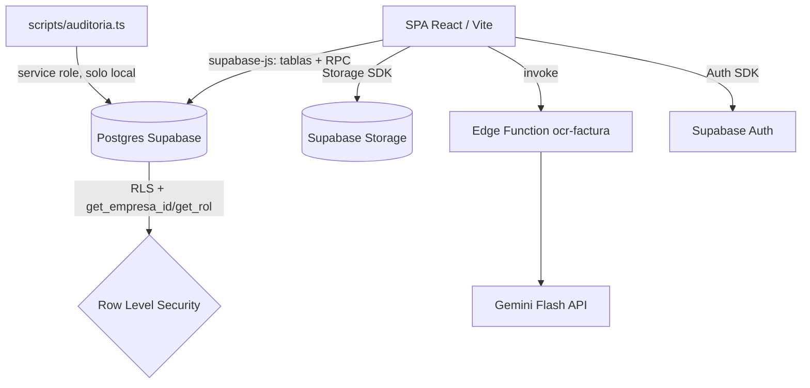
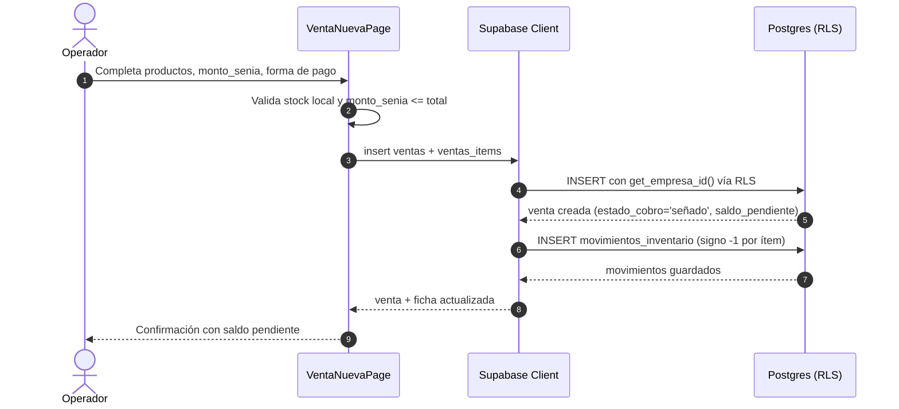
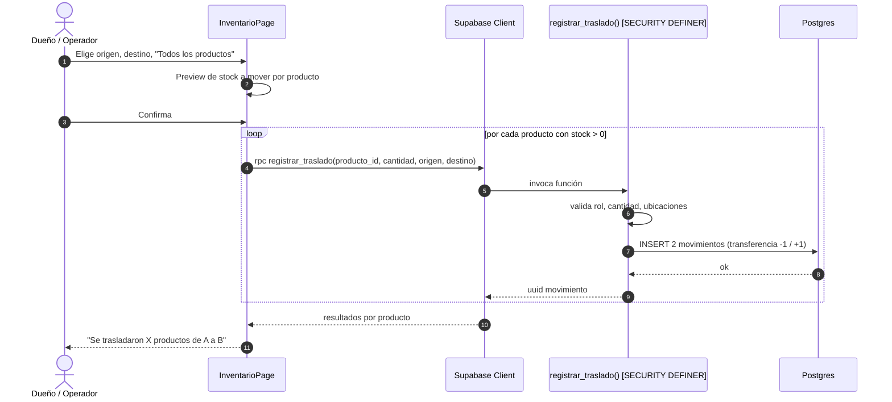
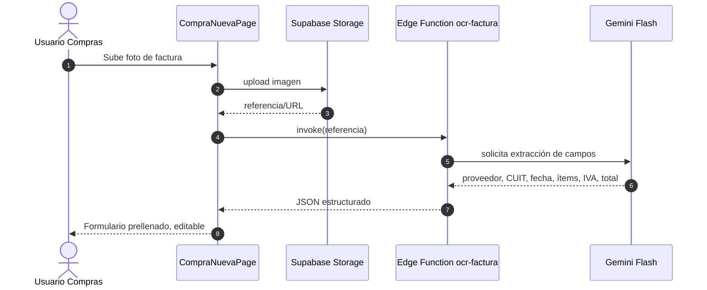
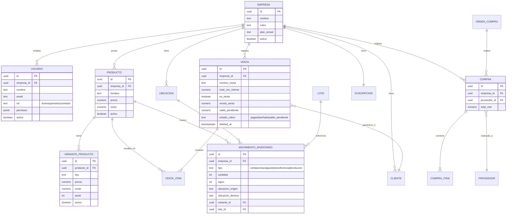

# Documento de Especificación Funcional: Analítica 360 (legacy pre-reescritura)

> **Repositorio Analizado:** `analitica-360` (rama `main`, snapshot previo a la reescritura NestJS+Next.js)
> **Fecha de Generación:** 2026-09-21
> **Versión de Documentación:** `1.0.0`
> **Propósito:** Checklist de aceptación para la Fase 8 del plan de reescritura — ninguna ruta, módulo, ítem de menú o regla de negocio listada acá puede faltar en el sistema nuevo sin que sea una decisión explícita.

---

## 📋 Índice
1. [Resumen Ejecutivo y Propósito](#1-resumen-ejecutivo-y-propósito)
2. [Arquitectura del Sistema y Tecnologías](#2-arquitectura-del-sistema-y-tecnologías)
3. [Historias de Usuario](#3-historias-de-usuario)
4. [Casos de Uso Detallados](#4-casos-de-uso-detallados)
5. [Diagramas de Secuencia y Procesos](#5-diagramas-de-secuencia-y-procesos)
6. [Modelo de Datos y Entidades](#6-modelo-de-datos-y-entidades)
7. [Catálogo de RPCs / Tablas Supabase](#7-catálogo-de-rpcs--tablas-supabase)
8. [Checklist de cobertura: rutas y menú](#8-checklist-de-cobertura-rutas-y-menú)

---

## 1. Resumen Ejecutivo y Propósito

Analítica 360 es un SaaS multi-tenant de gestión comercial (stock, ventas,
compras, clientes, pedidos, analytics) para comercios (ferias, locales,
depósitos, mayoristas chicos). Cada comercio es una **empresa** aislada.
Roles: **dueño** (todo, incl. Configuración), **operador/colaborador**
(permisos granulares por módulo y por acción), **contador** (solo lectura
gratis sobre Inicio/Productos/Ventas/Compras/Analytics/Contabilidad, no
consume licencia del plan — `supabase/070_rol_contador.sql`). Planes
Starter/Básico/Pro/Premium/E-commerce habilitan progresivamente más módulos
(`src/lib/planes.ts`). Regla de producto verificada en código (`src/routes.tsx`,
`GateModulos`): **ningún módulo o ruta existente se elimina**, solo se agregan.

## 2. Arquitectura del Sistema y Tecnologías

### Stack Tecnológico
- **Lenguaje:** TypeScript (frontend), PL/pgSQL (backend de facto).
- **Framework Web:** React 19 + React Router 7 + Vite — **no hay backend
  propio**: el cliente llama directo al SDK de Supabase (`src/lib/supabase.ts`).
- **Base de Datos:** PostgreSQL (Supabase), 72 migraciones en `supabase/*.sql`.
- **Autorización de datos:** Row Level Security + funciones `SECURITY DEFINER`
  `get_empresa_id()` / `get_rol()` (`supabase/070_rol_contador.sql` y otras).
- **Autenticación:** Supabase Auth (`src/auth.tsx`, `AuthProvider`), sesión
  vía `onAuthStateChange`, cierre por 8h de inactividad.
- **OCR:** Edge Function `ocr-factura` + Gemini Flash.
- **UI:** Tremor + Recharts, Tailwind, tokens en `src/theme.ts`.

### Diagrama de Arquitectura de Componentes

---

## 3. Historias de Usuario

### HU-001: Registrar una empresa nueva (alta)
**Como** visitante que se registra **Quiero** crear mi cuenta y mi empresa
**Para** empezar a operar el SaaS con un trial de módulos Premium.

Fundamento: `src/auth.tsx` (`registrar`, `rpcRegistrarEmpresa`),
`src/pages/RegistroPage.tsx`, `src/pages/CompletarAltaPage.tsx`.

##### Escenario 1: Alta exitosa sin invitación
- **Dado que** el visitante completa email, password, nombre de empresa, rubro y nombre de usuario
- **Cuando** confirma el registro
- **Entonces** Supabase Auth crea el usuario y se llama a `registrar_empresa` por RPC
- **Y** se inicia automáticamente un período de trial (`iniciarPeriodoPrueba`) con módulos Premium habilitados

##### Escenario 2: Registro con confirmación de email pendiente
- **Dado que** el proyecto exige confirmación de email
- **Cuando** el usuario se registra
- **Entonces** no hay `session` todavía y el sistema guarda el alta como pendiente (`guardarAltaPendiente`, localStorage)
- **Y** al confirmar el email y loguearse, `intentarAltaPendiente()` completa la creación de la empresa

##### Escenario 3: Registro vía invitación de equipo
- **Dado que** el visitante llega con un link de invitación (`invitacion.empresaId`)
- **Cuando** se registra
- **Entonces** el sistema no crea una empresa nueva, sino que llama `aceptarInvitacionColaborador` para unirlo a la empresa existente

---

### HU-002: Iniciar sesión y mantenerla activa
**Como** usuario registrado **Quiero** iniciar sesión **Para** operar el
sistema con los datos de mi empresa.

Fundamento: `src/auth.tsx` (`ingresar`, `onAuthStateChange`, `RequireAuth` en `src/routes.tsx`).

##### Escenario 1: Login exitoso
- **Dado que** el usuario tiene cuenta y contraseña válida
- **Cuando** envía el formulario de login
- **Entonces** se establece la sesión y se carga el perfil (`cargarPerfil`) con empresa, rol y accesos

##### Escenario 2: Cierre de sesión por inactividad
- **Dado que** el usuario está inactivo 8 horas
- **Cuando** vence la sesión
- **Entonces** el sistema cierra sesión y redirige a `/login`

##### Escenario 3: Credenciales inválidas
- **Dado que** el usuario ingresa email o password incorrectos
- **Cuando** intenta loguearse
- **Entonces** el sistema muestra "Email o contraseña incorrectos" (`mensajeAuth`)

---

### HU-003: Cargar un producto con variantes
**Como** dueño u operador con permiso `editar_productos` **Quiero** crear un
producto con variantes (color/talle) **Para** vender combinaciones específicas
con su propio stock y precio.

Fundamento: `src/pages/ProductoFormPage.tsx`, `src/lib/variantes.ts`,
`supabase/035_variantes.sql`, `supabase/036_variantes_compras_dimensiones.sql`.

##### Escenario 1: Alta con combinaciones automáticas
- **Dado que** la empresa tiene atributos globales definidos (Color, Talle)
- **Cuando** el usuario elige modo automático y selecciona valores por atributo
- **Entonces** el sistema genera todas las combinaciones como variantes, cada una con SKU, precio, costo y stock propios

##### Escenario 2: Desactivar una variante existente (bug corregido)
- **Dado que** una variante activa se desmarca (`activo: false`) y se guarda
- **Cuando** el formulario persiste los cambios
- **Entonces** el sistema hace **UPDATE** (no INSERT) si la variante ya existe por `id` o misma combinación
- **Y** al recargar el listado, la variante desactivada no vuelve a aparecer entre las activas

##### Escenario 3: Costo del producto = promedio ponderado
- **Dado que** el producto tiene variantes activas con distintos costos y stocks
- **Cuando** se recalcula el costo del producto padre
- **Entonces** el resultado es el promedio ponderado de costo × stock de las variantes activas (no un promedio simple)

---

### HU-004: Registrar una venta con seña
**Como** operador con permiso `registrar_ventas` **Quiero** cobrar una parte
del total como seña **Para** reservar mercadería sin cobrar el total en el
momento.

Fundamento: `src/lib/ventas.ts` (`EstadoCobro`), `supabase/068_senias.sql`
(`marcar_senia_venta`, `monto_venta`).

##### Escenario 1: Venta señada
- **Dado que** el operador marca la venta como seña e ingresa `monto_senia`
- **Cuando** confirma la venta
- **Entonces** `estado_cobro` queda en `'señado'` y `saldo_pendiente = total - monto_senia`

##### Escenario 2: Cobro del saldo pendiente
- **Dado que** una venta está en estado `'señado'`
- **Cuando** el operador cobra el saldo desde la ficha de venta
- **Entonces** `estado_cobro` pasa a `'pagado'`, `saldo_pendiente = 0` y se registra `fecha_cobro_saldo`

##### Escenario 3: Analytics cuenta lo cobrado, no el total teórico
- **Dado que** existen ventas señadas con saldo pendiente en el período analizado
- **Cuando** se calculan los totales de Analytics
- **Entonces** el monto considerado es `monto_venta()` (total menos saldo pendiente), no el total teórico de la venta

---

### HU-005: Anular una venta
**Como** usuario con permiso `anular_ventas` **Quiero** anular una venta
**Para** revertir un error sin borrar el historial.

Fundamento: `src/lib/ventas.ts` (`aplicarDeleted`, columna `deleted_at`),
`supabase/024_anular_ventas.sql`.

##### Escenario 1: Anulación exitosa
- **Dado que** la venta no está anulada
- **Cuando** el usuario confirma la anulación
- **Entonces** se setea `deleted_at`, la venta deja de listarse por defecto y el stock vendido se revierte (movimiento inverso en `movimientos_inventario`)

##### Escenario 2: Ver historial incluyendo anuladas
- **Dado que** el usuario activa el filtro "mostrar anuladas"
- **Cuando** consulta el listado
- **Entonces** `aplicarDeleted` invierte el filtro y trae también las filas con `deleted_at` no nulo

---

### HU-006: Traslado masivo entre ubicaciones
**Como** dueño u operador **Quiero** trasladar todos los productos de una
ubicación a otra en una sola operación **Para** no cargar traslados uno por
uno cuando muevo un stand entero.

Fundamento: `src/pages/InventarioPage.tsx`, `supabase/032_inventario_movimientos.sql`
(`registrar_traslado`).

##### Escenario 1: Traslado masivo
- **Dado que** el usuario elige "📦 Todos los productos" desde origen A hacia destino B
- **Cuando** confirma el traslado
- **Entonces** el sistema genera un `registrar_traslado` por producto, con dos movimientos tipo `transferencia` cada uno (`signo=-1` en origen, `signo=+1` en destino)
- **Y** muestra "Se trasladaron X productos de A a B" con el detalle

##### Escenario 2: Traslado individual con cantidad editable
- **Dado que** el usuario elige un producto puntual
- **Cuando** ingresa una cantidad mayor al stock disponible en origen
- **Entonces** el sistema rechaza la operación (`registrar_traslado` valida `CANTIDAD_INVALIDA` y stock insuficiente)

##### Escenario 3: Origen/destino inválidos
- **Dado que** origen y destino son la misma ubicación, o no existen como ubicaciones activas de la empresa
- **Cuando** se intenta el traslado
- **Entonces** la función SQL levanta `UBICACION_INVALIDA` y el traslado no se ejecuta

---

### HU-007: Compra con OCR de factura
**Como** dueño u operador de Compras **Quiero** fotografiar una factura y que
el sistema prellene los datos **Para** no tipear proveedor, CUIT, ítems y
total a mano.

Fundamento: `src/lib/ocr.ts`, `supabase/071_ocr_facturas.sql`, Edge Function `ocr-factura`.

##### Escenario 1: OCR exitoso
- **Dado que** el usuario sube una foto de factura al crear una compra
- **Cuando** se invoca la Edge Function `ocr-factura`
- **Entonces** Gemini Flash extrae proveedor, CUIT, fecha, número, ítems, IVA y total, y el formulario se prellena editable

##### Escenario 2: Costos extra sobre la compra
- **Dado que** la compra tiene flete, impuestos u otros costos adicionales
- **Cuando** se guarda
- **Entonces** `total_real` se calcula sumando esos costos extra al subtotal de ítems

---

### HU-008: Orden de compra con recepción parcial
**Como** dueño u operador de Compras **Quiero** emitir una orden de compra y
recibirla en partes **Para** reflejar entregas parciales del proveedor.

Fundamento: `src/pages/OrdenCompraNuevaPage.tsx`, `src/pages/OrdenCompraFichaPage.tsx`,
`supabase/059_ordenes_compra.sql`.

##### Escenario 1: Flujo de estados
- **Dado que** una OC se crea en estado `borrador`
- **Cuando** se envía al proveedor y luego se confirma
- **Entonces** pasa por `enviada` → `confirmada`

##### Escenario 2: Recepción parcial
- **Dado que** una OC confirmada recibe solo una parte de los ítems
- **Cuando** se registra la recepción parcial
- **Entonces** la OC queda en estado de recepción parcial y genera una compra por lo efectivamente recibido, sin cerrar la orden completa

---

### HU-009: Invitar un colaborador con rol contador
**Como** dueño **Quiero** invitar a mi contador con acceso gratuito de solo
lectura **Para** que audite sin poder operar ni consumir un cupo de usuario
del plan.

Fundamento: `supabase/070_rol_contador.sql` (`invitar_contador`), `src/lib/permisos.ts` (`accesoContador`).

##### Escenario 1: Invitación exitosa
- **Dado que** el dueño invita por email con rol `contador`
- **Cuando** el invitado acepta
- **Entonces** el usuario queda con `rol = 'contador'`, acceso a Inicio/Productos/Ventas/Compras/Analytics/Contabilidad, y `ver_costos`/`ver_reportes` en `true`

##### Escenario 2: Restricción de solo lectura
- **Dado que** un usuario tiene `rol = 'contador'`
- **Cuando** intenta registrar una venta, editar un producto o anular una operación
- **Entonces** el sistema bloquea la acción (`esSoloLectura`, guards de UI y RLS)

##### Escenario 3: No consume cupo del plan
- **Dado que** el plan de la empresa tiene un tope de usuarios (ej. Básico = 2)
- **Cuando** se invita a un contador adicional
- **Entonces** ese usuario no cuenta contra el tope `max_usuarios` del plan

---

### HU-010: Segmentar clientes y enviar difusión por WhatsApp
**Como** dueño u operador con permiso `gestionar_clientes` **Quiero**
segmentar clientes (VIP, en riesgo, inactivos, cumpleaños) **Para** enviarles
comunicaciones dirigidas por WhatsApp.

Fundamento: `src/lib/segmentosClientes.ts`, `src/lib/difusiones.ts`, `supabase/065_segmentos_clientes.sql`, `supabase/066_difusiones.sql`.

##### Escenario 1: Segmento "inactivos +60 días"
- **Dado que** un cliente no registra compras en los últimos 60 días
- **Cuando** se calculan los segmentos
- **Entonces** el cliente aparece en el segmento "inactivos"

##### Escenario 2: Difusión con plantilla
- **Dado que** el usuario elige un segmento y una plantilla de WhatsApp
- **Cuando** envía la difusión
- **Entonces** el sistema arma el link/mensaje por cliente del segmento usando la plantilla

---

### HU-011: Ver Analytics de Productos con fallback
**Como** dueño **Quiero** ver el rendimiento de mis productos en el tab
Productos de Analytics **Para** decidir qué reponer o descontinuar.

Fundamento: bug reciente documentado — `supabase/072_analytics_periodo_productos.sql`.

##### Escenario 1: RPC devuelve productos directamente
- **Dado que** `analytics_periodo` devuelve `data.productos`
- **Cuando** se renderiza el tab
- **Entonces** se usa esa lista directamente

##### Escenario 2: Fallback cuando el RPC no trae productos
- **Dado que** `data.productos` viene vacío o ausente
- **Cuando** se renderiza el tab
- **Entonces** el cliente intenta `analytics_top_productos`, y si tampoco hay datos, arma la tabla a partir de `ventas_items`
- **Y** la tabla **no se oculta** solo porque la empresa no cargó costos (antes sí se ocultaba — bug corregido)

---

### HU-012: Exportar todos los datos de la empresa a Excel
**Como** dueño **Quiero** exportar todos mis datos **Para** tener un respaldo
propio fuera del SaaS.

Fundamento: `src/lib/exportarDatos.ts`, `src/pages/ConfiguracionPage.tsx`.

##### Escenario 1: Exportación completa
- **Dado que** el dueño solicita la exportación desde Configuración
- **Cuando** se genera el archivo
- **Entonces** incluye productos, ventas, compras, clientes, inventario y demás entidades de su empresa en formato Excel

---

### HU-013: Gate de módulos por plan
**Como** usuario de un plan con módulos limitados **Quiero** ver una pantalla
de upgrade al entrar a un módulo no incluido **Para** entender qué plan
necesito.

Fundamento: `src/routes.tsx` (`GateModulos`), `src/lib/planes.ts` (`tieneAcceso`), `src/lib/suscripcion.ts` (`estaEnTrial`).

##### Escenario 1: Módulo no incluido en el plan, sin trial
- **Dado que** el plan actual no incluye el módulo de la ruta visitada y la empresa no está en trial
- **Cuando** el usuario navega a esa ruta
- **Entonces** se muestra `UpgradePlanPage` en vez del contenido del módulo

##### Escenario 2: Trial activo habilita módulos Premium
- **Dado que** la empresa está dentro del período de trial
- **Cuando** navega a un módulo Premium (ej. Insights)
- **Entonces** el acceso se permite aunque el plan de pago actual no lo incluya

---

## 4. Casos de Uso Detallados

### CU-001: Registrar venta con seña
| Atributo | Detalle |
| :--- | :--- |
| **Identificador** | CU-001 |
| **Actor Principal** | Operador / Dueño con permiso `registrar_ventas` |
| **Precondiciones** | Sesión activa, empresa con productos/variantes cargados, permiso de módulo `ventas` |
| **Disparador** | Envío del formulario en `VentaNuevaPage` |
| **Postcondiciones** | Fila en `ventas` + `ventas_items`, movimiento de stock negativo por ítem, `estado_cobro` acorde a si hubo seña |

#### Flujo Principal:
1. El operador selecciona productos/variantes, cantidades, forma de pago, cuotas, descuento y ubicación de origen.
2. El operador marca "es seña" e ingresa `monto_senia`.
3. El sistema valida stock disponible por producto/variante en la ubicación de origen.
4. El sistema calcula `total`, `saldo_pendiente = total - monto_senia`, `estado_cobro = 'señado'`.
5. El sistema inserta la venta y sus ítems, genera movimientos de inventario tipo `venta` (signo −1) por cada ítem.
6. El sistema retorna la venta creada con número de venta asignado.

#### Flujos Alternativos / Excepciones:
- **FA-01: Stock insuficiente** — 3a. el sistema detecta cantidad solicitada mayor a stock en la ubicación de origen; 3b. rechaza la venta con error de validación.
- **FA-02: Monto de seña mayor al total** — 4a. el sistema detecta `monto_senia > total`; 4b. rechaza la operación.
- **FA-03: Cliente obligatorio según configuración de flujo de venta** — 1a. si la empresa configuró cliente obligatorio y no se seleccionó uno, el sistema bloquea el submit antes de llamar al backend.

---

### CU-002: Traslado masivo de inventario entre ubicaciones
| Atributo | Detalle |
| :--- | :--- |
| **Identificador** | CU-002 |
| **Actor Principal** | Dueño u operador |
| **Precondiciones** | Empresa con ≥2 ubicaciones activas, productos con stock en la ubicación origen |
| **Disparador** | Selección de "📦 Todos los productos" en Inventario → Traslado |
| **Postcondiciones** | Por cada producto trasladado: dos movimientos `transferencia` (signo −1 origen, +1 destino) |

#### Flujo Principal:
1. El usuario elige ubicación origen y destino.
2. El usuario elige "Todos los productos"; el sistema muestra preview de stock a mover por producto.
3. El usuario confirma.
4. El sistema, por cada producto con stock > 0 en origen, llama `registrar_traslado(producto_id, cantidad, origen, destino, fecha, notas)`.
5. La función SQL valida rol (`dueno`/`operador`), cantidad > 0, ubicaciones activas y distintas.
6. La función inserta los dos movimientos de `transferencia` por producto.
7. El sistema muestra "Se trasladaron X productos de A a B" con detalle por producto.

#### Flujos Alternativos / Excepciones:
- **FA-01: Rol no autorizado** — 5a. `get_rol()` no es `dueno` ni `operador`; 5b. la función lanza `NO_AUTORIZADO`.
- **FA-02: Ubicación inválida** — 5c. origen y destino son iguales, o alguna no existe activa para la empresa; 5d. la función lanza `UBICACION_INVALIDA`.
- **FA-03: Traslado individual con cantidad parcial** — variante del flujo donde el usuario edita la cantidad de un producto puntual, con máximo = stock disponible en origen.

---

### CU-003: Invitar colaborador con rol contador
| Atributo | Detalle |
| :--- | :--- |
| **Identificador** | CU-003 |
| **Actor Principal** | Dueño |
| **Precondiciones** | Sesión activa como dueño de la empresa |
| **Disparador** | Formulario "Invitar equipo" en Configuración, rol = contador |
| **Postcondiciones** | Fila en `invitaciones_colaboradores` con rol `contador` y accesos de solo lectura preconfigurados |

#### Flujo Principal:
1. El dueño ingresa el email a invitar y elige rol "Contador".
2. El sistema llama `invitar_contador(email)`.
3. La función arma `v_modulos` (inicio, productos, ventas, compras, analytics, contabilidad en `true`; resto en `false`) y `v_acciones` (`ver_costos`, `ver_reportes` en `true`; el resto en `false`).
4. El sistema genera la invitación pendiente y (fuera de este CU) dispara el email de invitación vía Resend.
5. Al aceptar, el invitado queda creado como `usuarios.rol = 'contador'` con esos accesos.

#### Flujos Alternativos / Excepciones:
- **FA-01: Email ya es usuario de la empresa** — el sistema rechaza la invitación duplicada.
- **FA-02: Invitación expirada o inválida al aceptar** — `aceptarInvitacionColaborador` retorna `INVITACION_INVALIDA`; el cliente limpia la invitación pendiente sin crear el vínculo.

---

### CU-004: Compra con OCR de factura y costos extra
| Atributo | Detalle |
| :--- | :--- |
| **Identificador** | CU-004 |
| **Actor Principal** | Dueño u operador de Compras |
| **Precondiciones** | Sesión activa, módulo `compras` habilitado por plan |
| **Disparador** | Subida de foto de factura en `CompraNuevaPage` |
| **Postcondiciones** | Compra creada con `total_real` = subtotal ítems + costos extra; foto asociada en Storage |

#### Flujo Principal:
1. El usuario sube la foto de la factura.
2. El sistema sube la imagen a Supabase Storage y llama a la Edge Function `ocr-factura` con la referencia.
3. La Edge Function invoca Gemini Flash y devuelve proveedor, CUIT, fecha, número, ítems e IVA/total extraídos.
4. El formulario se prellena editable con esos datos.
5. El usuario revisa/corrige y agrega costos extra (flete, impuestos, otros).
6. El sistema calcula `total_real = subtotal_items + suma(costos_extra)` y guarda la compra con sus ítems (`costo_unitario` por ítem, impacta margen).

#### Flujos Alternativos / Excepciones:
- **FA-01: Falla la Edge Function / Gemini no responde** — 3a. timeout o error de la función; 3b. el formulario queda vacío para carga manual, sin bloquear la creación de la compra.
- **FA-02: OCR con campos ambiguos** — 4a. el modelo no logra extraer con confianza un campo (ej. CUIT ilegible); 4b. ese campo queda vacío para completar a mano.

---

### CU-005: Desactivar variante de producto sin perder historial
| Atributo | Detalle |
| :--- | :--- |
| **Identificador** | CU-005 |
| **Actor Principal** | Dueño u operador con permiso `editar_productos` |
| **Precondiciones** | Producto con variantes existentes, empresa con `usa_variantes = true` |
| **Disparador** | Guardar el formulario de producto con una variante desmarcada |
| **Postcondiciones** | Variante queda con `activo = false` en BD; no vuelve a listarse como activa; costo del producto recalculado |

#### Flujo Principal:
1. El usuario desmarca "activo" en una variante existente y guarda.
2. El sistema arma el payload con `activo: false` para esa variante.
3. El sistema busca si la variante ya existe por `id` o por misma combinación de atributos.
4. Si existe, ejecuta **UPDATE** (nunca INSERT) sobre esa fila.
5. El sistema recalcula el costo del producto como promedio ponderado de las variantes que siguen activas.
6. Al recargar el listado, solo se muestran variantes activas.

#### Flujos Alternativos / Excepciones:
- **FA-01 (bug histórico, ya corregido)**: el formulario regeneraba todas las combinaciones y a veces insertaba una fila nueva en vez de actualizar la existente, dejando la variante "desactivada" visible igual tras recargar. Cubierto por el log `[variantes a guardar]` para diagnóstico.

---

## 5. Diagramas de Secuencia y Procesos

### 5.1 Venta con seña

### 5.2 Traslado masivo

### 5.3 OCR de factura de compra

---

## 6. Modelo de Datos y Entidades

---

## 7. Catálogo de RPCs / Tablas Supabase

No hay API REST propia: la SPA usa el SDK `supabase-js` contra tablas (con
RLS) y funciones `SECURITY DEFINER` invocadas por RPC. Catálogo parcial de
las operaciones críticas (fuente: `supabase/*.sql`):

| Función / Tabla | Tipo | Descripción | Rol requerido |
| :--- | :--- | :--- | :--- |
| `registrar_empresa` | RPC | Alta de empresa + usuario dueño | Autenticado, sin empresa previa |
| `get_empresa_id()` | RPC interna (RLS) | Resuelve empresa del usuario autenticado | Cualquiera autenticado |
| `get_rol()` | RPC interna (RLS) | Resuelve rol normalizado (`administrador`→`dueno`, `operario`→`operador`) | Cualquiera autenticado |
| `marcar_senia_venta(id, monto)` | RPC | Marca una venta como señada | dueño, operador |
| `monto_venta(venta)` | Función SQL | Calcula el monto efectivamente cobrado | — |
| `registrar_traslado(...)` | RPC | Traslado de stock entre ubicaciones | dueño, operador |
| `listar_resumen_inventario()` | RPC | Resumen de stock por producto/ubicación | dueño, operador, contador (lectura) |
| `invitar_contador(email)` | RPC | Invita colaborador con rol contador y accesos de solo lectura | dueño |
| `analytics_periodo(...)` | RPC | Agregados de ventas/productos por período | dueño, operador con `ver_reportes`, contador |
| `ventas`, `ventas_items` | Tablas (RLS) | Ventas y sus ítems | según rol/permisos |
| `compras`, `compra_items` | Tablas (RLS) | Compras y sus ítems | según rol/permisos |
| `movimientos_inventario` | Tabla (RLS) | Kardex de stock, fuente de verdad del stock | según rol/permisos |
| `usuarios`, `invitaciones_colaboradores` | Tablas (RLS) | Equipo y accesos | dueño gestiona, cada uno lee lo propio |

---

## 8. Checklist de cobertura: rutas y menú

Toda fila de esta tabla debe tener un equivalente funcionando en el stack
nuevo (NestJS + Next.js) antes de cerrar la Fase 8 del plan de reescritura.
Fuente: `src/routes.tsx`, `App.tsx` (lazy routes), `src/lib/permisos.ts`
(`MODULOS_EQUIPO`).

| Ruta / módulo legacy | En menú principal | HU/CU relacionados |
| :--- | :--- | :--- |
| `/inicio` (Dashboard) | Sí | — |
| `/productos`, `/nuevo`, `/:id` | Sí | HU-003, CU-005 |
| `/ventas`, `/nueva`, `/:id` | Sí | HU-004, HU-005, CU-001 |
| `/ventas/devoluciones/nueva`, `/:id` | Tab en Ventas | — |
| `/pedidos` y subrutas | Sí | — |
| `/compras`, `/compras/oc/...` | Sí | HU-007, HU-008, CU-004 |
| `/proveedores` | Sí | — |
| `/clientes` | Sí | HU-010 |
| `/inventario` | Sí | HU-006, CU-002 |
| `/analytics?tab=` | Sí | HU-011 |
| `/contabilidad` | **No** (solo tab/URL directa) | — |
| `/insights` | **No** (solo tab/URL directa) | — |
| `/configuracion` | Sí (solo dueño) | HU-009, HU-012 |
| `/soporte` | Sí | — |
| `/planes` | Sí | HU-013 |
| `/admin` | No (superadmin) | — |
| Rol contador (solo lectura) | — | HU-009 |
| Gate de módulos por plan | — | HU-013 |

---

## Notas para la Fase 3 (diseño del schema Prisma) y Fase 8 (QA)

- El stock **nunca** es una columna fija: se deriva de `movimientos_inventario`
  (confirmado en `listar_resumen_inventario()` y `src/lib/inventario.ts`).
- `get_rol()` normaliza roles legacy (`administrador`→`dueno`,
  `operario`→`operador`) — al migrar a Clerk + guards NestJS, el nuevo enum
  de rol debe seguir soportando exactamente estos 3 roles funcionales
  (dueño/operador/contador), sin renombrar valores existentes en datos migrados.
- `/contabilidad` e `/insights` **no están en el menú principal** pero deben
  seguir siendo rutas navegables directamente — confirmado en código, no solo
  en la descripción de producto.
